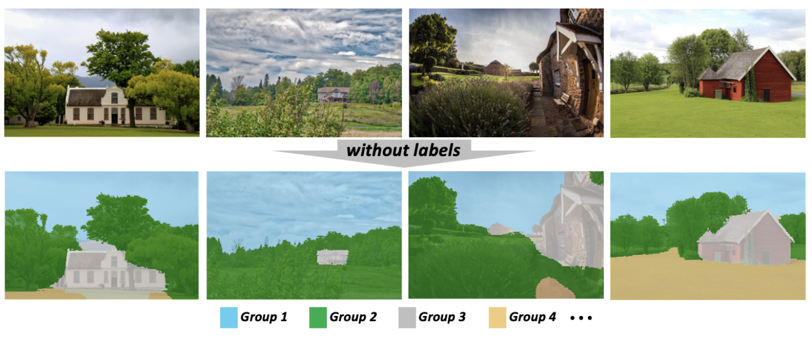
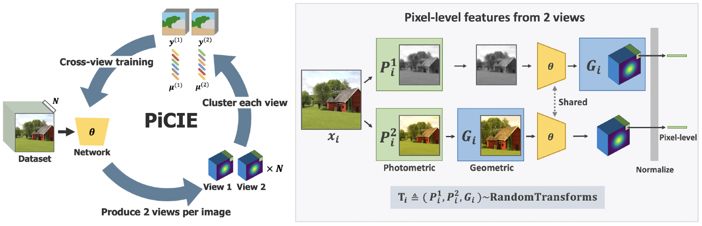

# PiCIE: Unsupervised Semantic Segmentation using Invariance and Equivariance in Clustering

*[Jang Hyun Cho](https://sites.google.com/view/janghyuncho/)*<sup>1</sup>,
*[Utkarsh Mall](https://www.cs.cornell.edu/~utkarshm/)*<sup>2</sup>,
*[Kavita Bala](http://www.cs.cornell.edu/~kb/)*<sup>2</sup>,
*[Bharath Hariharan](http://home.bharathh.info)*<sup>2</sup>

<sup>1</sup> The University of Texas at Austin, <sup>2</sup> Cornell University

[[paper](https://openaccess.thecvf.com/content/CVPR2021/papers/Cho_PiCIE_Unsupervised_Semantic_Segmentation_Using_Invariance_and_Equivariance_in_Clustering_CVPR_2021_paper.pdf)] [[supp](https://openaccess.thecvf.com/content/CVPR2021/supplemental/Cho_PiCIE_Unsupervised_Semantic_CVPR_2021_supplemental.pdf)] [[project page](https://sites.google.com/view/picie-cvpr2021/home)]

<p align="center">  </p>
<p align="center">  </p>

This repository is the official implementation of [PiCIE: Unsupervised Semantic Segmentation using Invariance and Equivariance in Clustering](https://openaccess.thecvf.com/content/CVPR2021/papers/Cho_PiCIE_Unsupervised_Semantic_Segmentation_Using_Invariance_and_Equivariance_in_Clustering_CVPR_2021_paper.pdf), CVPR 2021. 

Contact: Jang Hyun Cho [janghyuncho7@utexas.edu](mailto:janghyuncho7@utexas.edu). 

Please feel free to reach out for any questions or discussions!

## Setup
Setting up for this project involves installing dependencies and preparing the datasets. 

### Installing dependencies
To install all the dependencies, please run the following:
~~~
conda env create -f env.yml
~~~

### Preparing Dataset 
Please download the [trainset](http://images.cocodataset.org/zips/train2017.zip) and the [validset](http://images.cocodataset.org/zips/val2017.zip) of COCO dataset as well as the [annotations](http://images.cocodataset.org/annotations/annotations_trainval2017.zip). Place the dataset as following:
~~~
/your/dataset/directory/
      └── coco/
            ├── images/
            │     ├── train2017/
            │     │       ├── xxxxxxxxx.jpg
            │     │       └── ...
            │     └── val2017/
            │             ├── xxxxxxxxx.jpg
            │             └── ...
            └── annotations/
                  ├── COCO_2017_train.json
                  └── COCO_2017_val.json
~~~
Then, create a symbolic link as following:
~~~
cd PiCIE
ln -s /your/dataset/directory/ datasets 
~~~
Similarly, setup a symbolic link for the save directory as following:
~~~
ln -s /your/save/directory/ results
~~~
Finally, move *curated* folder to *datasets/coco/*:
~~~
mv curated datasets/coco/
~~~
This will setup the dataset that contains the same set of images with [IIC](https://github.com/xu-ji/IIC/blob/master/code/datasets/segmentation/cocostuff.py).

## Running PiCIE 
Below are training and testing commands to train PiCIE. 
### Training
Below line will run the training code with default setting in the background. 
~~~
nohup ./sh_files/train_picie.sh > logs/picie_train.out & 
~~~
Below line will run the testing code with default setting in the background.
### Testing 
~~~
nohup ./sh_files/test_picie.sh > logs/picie_test.out &
~~~

## Pretrained Models (To be updated soon)
We have pretrained PiCIE weights. 
|Method|Dataset    |Pre-trained weight             | Train log                |
|:----:|:---------:|:-----------------------------:|:------------------------:|
|PiCIE |COCO       |weight|log  |
|PiCIE |Cityscapes |weight|log |
|MDC   |COCO       |weight|log |
|MDC   |Cityscapes |weight|log |


## Visualization (To be updated soon)
We prepared [a jupyter notebook](visualize.ipynb) for visualization.


## Citation
If you find PiCIE useful in your research, please consider citing:
```
@inproceedings{Cho2021PiCIE,
  title = {PiCIE: Unsupervised Semantic Segmentation using Invariance and Equivariance in Clustering},
  author = {Jang Hyun Cho and  Utkarsh Mall and  Kavita Bala and  Bharath Hariharan},
  year = {2021},
  booktitle = {CVPR}
}
```
## Acknowledgements 
We thank Facebook AI Research for the open-soource library [Faiss](https://github.com/facebookresearch/faiss). Also, our implementation largely borrows from [DeepCluster](https://github.com/facebookresearch/deepcluster) and [DeeperCluster](https://github.com/facebookresearch/DeeperCluster) for clustering with Faiss. 

#### TODO's
- [x] Dependency & dataset setup.
- [x] Clear up and add complete train & test codes. 
- [x] Baseline MDC code.
- [ ] Weights and logs.
- [ ] Make visualization notebook easier to use + better colors. 

